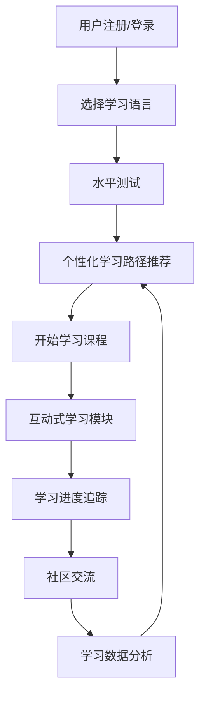

## 1. Product Overview
多语种学习在线教育平台，支持英语、日语、韩语等主流语言的沉浸式学习体验。
- 解决用户在语言学习过程中的互动性和个性化需求，提供全方位的语言学习工具。
- 目标用户为语言学习者，市场价值在于提供高效、个性化的语言学习解决方案。

## 2. Core Features

### 2.1 User Roles
| 角色 | 注册方式 | 核心权限 |
|------|---------------------|------------------|
| 普通用户 | 邮箱/第三方登录 | 浏览课程、使用学习功能、参与社区 |
| 高级用户 | 付费升级 | 额外学习内容、高级分析、专属学习路径 |

### 2.2 Feature Module
1. **首页**：语言选择、课程推荐、学习进度概览、社区动态
2. **课程中心**：分级课程体系、课程详情、学习模块入口
3. **学习中心**：互动式学习模块、学习进度追踪、个性化学习路径
4. **社区**：用户交流、成就展示、学习分享
5. **个人中心**：用户信息、学习数据、账户设置

### 2.3 Page Details
| 页面名称 | 模块名称 | 功能描述 |
|-----------|-------------|---------------------|
| 首页 | 语言选择 | 支持英语、日语、韩语等多种语言切换 |
| 首页 | 课程推荐 | 根据用户学习历史和兴趣推荐适合的课程 |
| 首页 | 学习进度概览 | 展示当前学习状态和完成情况 |
| 首页 | 社区动态 | 显示社区热门话题和用户成就 |
| 课程中心 | 分级课程体系 | 按难度等级（初级、中级、高级）组织课程 |
| 课程中心 | 课程详情 | 课程内容介绍、学习目标、预计时长 |
| 课程中心 | 学习模块入口 | 单词记忆、语法练习、口语跟读、听力训练 |
| 学习中心 | 互动式学习模块 | 提供多样化的学习活动和练习 |
| 学习中心 | 学习进度追踪 | 记录学习时间、完成率、掌握程度 |
| 学习中心 | 个性化学习路径 | 根据学习数据推荐定制化学习计划 |
| 社区 | 用户交流 | 论坛、讨论组、学习伙伴匹配 |
| 社区 | 成就展示 | 学习徽章、排行榜、学习里程碑 |
| 社区 | 学习分享 | 学习笔记、心得分享、资源推荐 |
| 个人中心 | 用户信息 | 个人资料管理、学习统计 |
| 个人中心 | 学习数据 | 详细学习记录、能力评估报告 |
| 个人中心 | 账户设置 | 密码修改、通知设置、偏好设置 |

## 3. Core Process
**用户学习流程**：
1. 用户注册/登录平台
2. 选择目标学习语言
3. 进行初始水平测试
4. 系统推荐个性化学习路径
5. 用户开始学习课程内容
6. 完成互动式学习模块练习
7. 系统记录学习数据并更新进度
8. 用户参与社区活动分享学习心得
9. 系统根据学习表现调整推荐内容

**Mermaid流程图**：

## 4. User Interface Design
### 4.1 Design Style
- **主色调**：蓝色 (#3B82F6) 和绿色 (#10B981)
- **辅助色**：橙色 (#F59E0B)、紫色 (#8B5CF6)
- **按钮样式**：圆角按钮，带有轻微的阴影和悬停效果
- **字体**：无衬线字体，主标题使用较大字号，内容文本清晰易读
- **布局风格**：卡片式布局，清晰的视觉层次，响应式设计
- **图标风格**：简约线性图标，搭配适当的彩色强调

### 4.2 Page Design Overview
| 页面名称 | 模块名称 | UI元素 |
|-----------|-------------|-------------|
| 首页 | 语言选择 | 大型语言选择卡片，带有语言特色图标，悬停时有轻微放大效果 |
| 首页 | 课程推荐 | 横向滚动的课程卡片，包含课程封面、名称、难度和评分 |
| 首页 | 学习进度概览 | 环形进度条，显示当前学习状态和目标完成情况 |
| 课程中心 | 分级课程体系 | 垂直标签页，按难度等级分组展示课程，带有进度指示 |
| 学习中心 | 互动式学习模块 | 多样化的练习界面，包括卡片翻转、拖放匹配、语音输入等交互元素 |
| 社区 | 成就展示 | 徽章墙设计，动态展示用户获得的学习成就和排名 |
| 个人中心 | 学习数据 | 数据可视化图表，展示学习时间、掌握程度等关键指标 |

### 4.3 Responsiveness
- **设计原则**：桌面优先，移动适配
- **断点设置**：
  - 桌面端：1200px及以上
  - 平板端：768px-1199px
  - 移动端：360px-767px
- **移动优化**：简化导航，优化触摸交互，确保内容可读性

### 4.4 3D Scene Guidance
- **应用场景**：语言学习中的沉浸式体验，如虚拟场景对话练习
- **技术实现**：使用Three.js创建简单的3D场景，支持基础的场景切换和交互