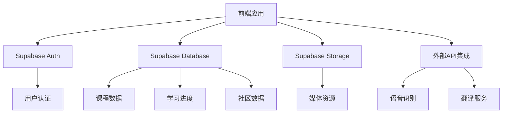
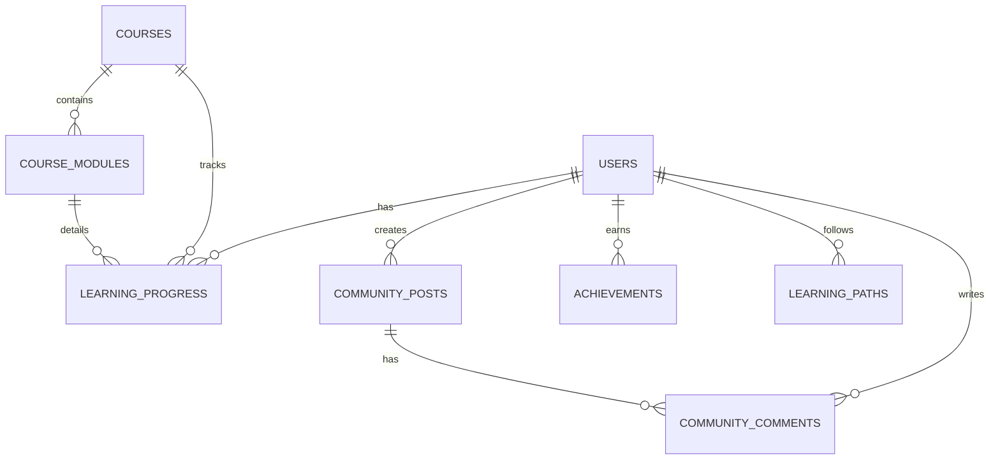

## 1. Architecture Design


## 2. Technology Description
- **前端**：React@18 + TypeScript + Tailwind CSS@3 + Vite
- **初始化工具**：vite-init
- **后端**：Supabase (认证、数据库、存储)
- **数据库**：Supabase (PostgreSQL)
- **状态管理**：Zustand
- **路由**：React Router DOM
- **图标**：Lucide React
- **图表**：Recharts
- **动画**：CSS animations + Framer Motion

## 3. Route Definitions
| 路由 | 用途 |
|-------|---------|
| / | 首页 |
| /courses | 课程中心 |
| /courses/:id | 课程详情 |
| /learn | 学习中心 |
| /learn/:module | 学习模块 |
| /community | 社区 |
| /profile | 个人中心 |
| /auth | 认证页面 |
| /auth/login | 登录 |
| /auth/register | 注册 |

## 4. API Definitions
### 4.1 Supabase Client SDK
```typescript
// 初始化Supabase客户端
import { createClient } from '@supabase/supabase-js'

const supabaseUrl = import.meta.env.VITE_SUPABASE_URL
const supabaseAnonKey = import.meta.env.VITE_SUPABASE_ANON_KEY

export const supabase = createClient(supabaseUrl, supabaseAnonKey)
```

### 4.2 主要API调用
- **用户认证**：
  - `supabase.auth.signUp()` - 注册新用户
  - `supabase.auth.signInWithPassword()` - 密码登录
  - `supabase.auth.signInWithOAuth()` - 第三方登录
  - `supabase.auth.signOut()` - 退出登录
  - `supabase.auth.getUser()` - 获取当前用户信息

- **课程数据**：
  - `supabase.from('courses').select('*')` - 获取课程列表
  - `supabase.from('courses').select('*').eq('id', courseId)` - 获取课程详情
  - `supabase.from('course_modules').select('*').eq('course_id', courseId)` - 获取课程模块

- **学习进度**：
  - `supabase.from('learning_progress').insert({...})` - 记录学习进度
  - `supabase.from('learning_progress').select('*').eq('user_id', userId)` - 获取用户学习进度
  - `supabase.from('learning_progress').update({...}).eq('id', progressId)` - 更新学习进度

- **社区数据**：
  - `supabase.from('community_posts').insert({...})` - 创建社区帖子
  - `supabase.from('community_posts').select('*')` - 获取社区帖子列表
  - `supabase.from('community_comments').insert({...})` - 评论帖子

## 5. Data Model
### 5.1 Data Model Definition


### 5.2 Data Definition Language
```sql
-- 用户表（由Supabase Auth自动创建）
-- 不需要手动创建，使用Supabase Auth的users表

-- 课程表
CREATE TABLE courses (
  id SERIAL PRIMARY KEY,
  title VARCHAR(255) NOT NULL,
  language VARCHAR(50) NOT NULL,
  level VARCHAR(20) NOT NULL, -- beginner, intermediate, advanced
  description TEXT,
  cover_image VARCHAR(255),
  duration INTEGER, -- 预计学习时长（分钟）
  created_at TIMESTAMP DEFAULT NOW(),
  updated_at TIMESTAMP DEFAULT NOW()
);

-- 课程模块表
CREATE TABLE course_modules (
  id SERIAL PRIMARY KEY,
  course_id INTEGER NOT NULL,
  title VARCHAR(255) NOT NULL,
  type VARCHAR(50) NOT NULL, -- vocabulary, grammar, speaking, listening
  content JSONB,
  order_index INTEGER,
  created_at TIMESTAMP DEFAULT NOW()
);

-- 学习进度表
CREATE TABLE learning_progress (
  id SERIAL PRIMARY KEY,
  user_id UUID NOT NULL,
  course_id INTEGER NOT NULL,
  module_id INTEGER,
  progress_percentage INTEGER DEFAULT 0,
  completed BOOLEAN DEFAULT FALSE,
  last_accessed TIMESTAMP DEFAULT NOW(),
  created_at TIMESTAMP DEFAULT NOW(),
  updated_at TIMESTAMP DEFAULT NOW()
);

-- 社区帖子表
CREATE TABLE community_posts (
  id SERIAL PRIMARY KEY,
  user_id UUID NOT NULL,
  title VARCHAR(255) NOT NULL,
  content TEXT NOT NULL,
  language VARCHAR(50),
  likes INTEGER DEFAULT 0,
  created_at TIMESTAMP DEFAULT NOW(),
  updated_at TIMESTAMP DEFAULT NOW()
);

-- 社区评论表
CREATE TABLE community_comments (
  id SERIAL PRIMARY KEY,
  post_id INTEGER NOT NULL,
  user_id UUID NOT NULL,
  content TEXT NOT NULL,
  created_at TIMESTAMP DEFAULT NOW()
);

-- 成就表
CREATE TABLE achievements (
  id SERIAL PRIMARY KEY,
  user_id UUID NOT NULL,
  title VARCHAR(255) NOT NULL,
  description TEXT,
  badge_image VARCHAR(255),
  earned_at TIMESTAMP DEFAULT NOW()
);

-- 学习路径表
CREATE TABLE learning_paths (
  id SERIAL PRIMARY KEY,
  user_id UUID NOT NULL,
  language VARCHAR(50) NOT NULL,
  current_level VARCHAR(20),
  goals JSONB,
  recommended_courses JSONB,
  created_at TIMESTAMP DEFAULT NOW(),
  updated_at TIMESTAMP DEFAULT NOW()
);

-- 索引
CREATE INDEX idx_courses_language_level ON courses(language, level);
CREATE INDEX idx_learning_progress_user_course ON learning_progress(user_id, course_id);
CREATE INDEX idx_community_posts_created_at ON community_posts(created_at DESC);

-- 权限设置
GRANT SELECT ON courses TO anon;
GRANT SELECT ON course_modules TO anon;
GRANT ALL PRIVILEGES ON learning_progress TO authenticated;
GRANT ALL PRIVILEGES ON community_posts TO authenticated;
GRANT ALL PRIVILEGES ON community_comments TO authenticated;
GRANT ALL PRIVILEGES ON achievements TO authenticated;
GRANT ALL PRIVILEGES ON learning_paths TO authenticated;
```